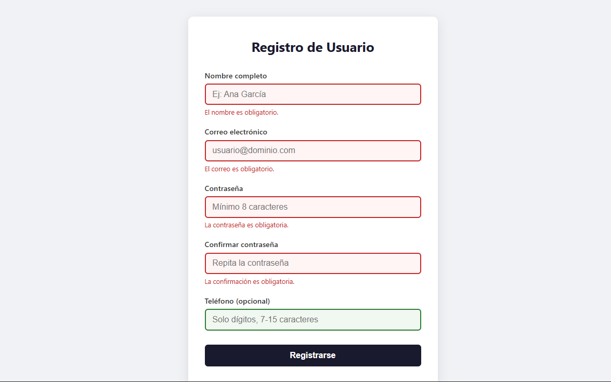
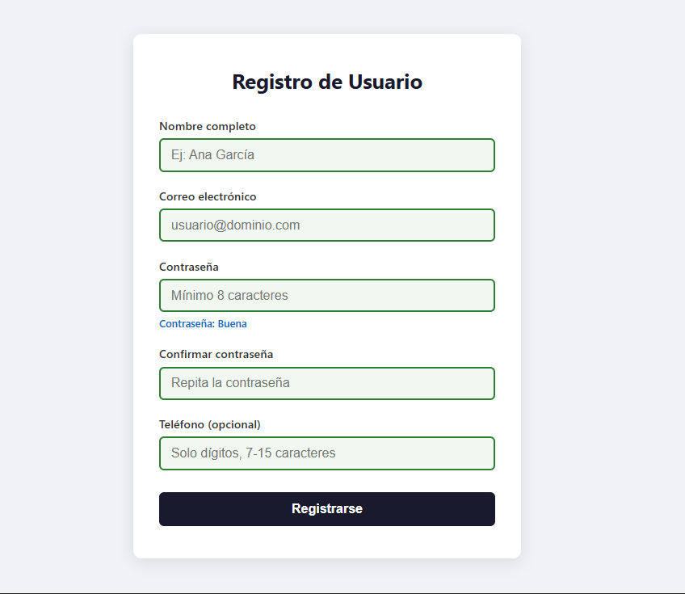

# Registro de Usuario — U4 Post-Contenido 2

Formulario de registro con validación completa del lado del cliente.

## Tecnologías
- HTML5 (Constraint Validation API)
- CSS3
- JavaScript ES6 (arrow functions, template literals, destructuring)

## Funcionalidades
- Validación en tiempo real por campo (evento blur)
- Mensajes de error específicos por campo
- Indicador de fortaleza de contraseña
- Mensaje de éxito al enviar correctamente

## Cómo ejecutar
1. Clona el repositorio
2. Abre `index.html` con Live Server en VS Code

## Capturas de pantalla
### Errores de validación

### Registro exitoso
